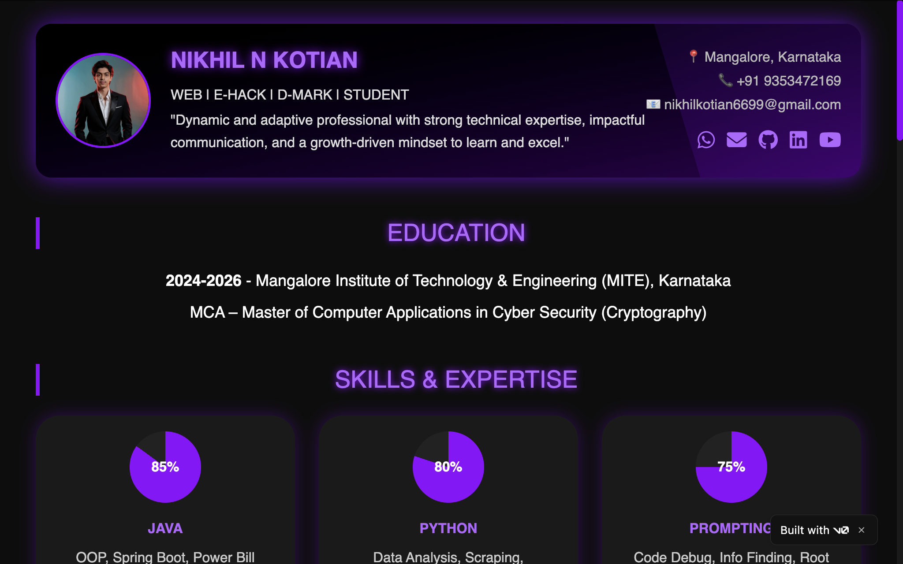
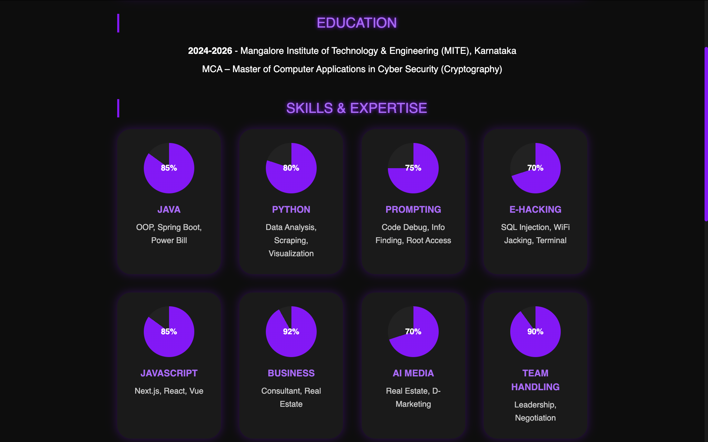
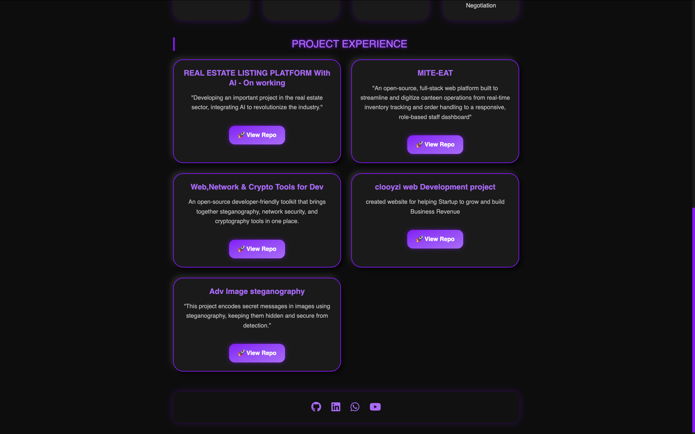

# Kotian CV Template (Traditional Gaming Theme)

> **Install the traditional gaming template of myself, customize it in levels, and upgrade it into something legendary.**

A Next.js + TypeScript CV/Resume template styled like a classic game UI. Level up your profile, achievements, and skills with reusable UI components.

---

## 🔥 Preview

> Add screenshots of your customized CV from the `/public` folder.









---

## 🧰 Tech Stack

* **Next.js** (App Router)
* **TypeScript**
* **Tailwind CSS**
* **shadcn/ui** (Radix primitives)
* React hooks & utilities
* Package manager: **pnpm** (npm/yarn also supported)

---

## 📁 Project Structure

```
.
├─ app/
│  ├─ globals.css              # Global styles (imports Tailwind, base resets)
│  ├─ layout.tsx               # Root layout, metadata, theme provider
│  └─ page.tsx                 # Main CV page (edit your sections here)
│
├─ components/
│  ├─ theme-provider.tsx       # Light/Dark system/theme wrapper
│  └─ ui/                      # Reusable UI components
│     ├─ skeleton.tsx
│     ├─ slider.tsx
│     ├─ sonner.tsx
│     ├─ switch.tsx
│     ├─ table.tsx
│     ├─ tabs.tsx
│     ├─ textarea.tsx
│     ├─ toast.tsx
│     ├─ toaster.tsx
│     ├─ toggle-group.tsx
│     ├─ toggle.tsx
│     ├─ tooltip.tsx
│     ├─ use-mobile.tsx
│     └─ use-toast.ts
│
├─ hooks/
│  ├─ use-mobile.ts            # Hook for mobile detection/state
│  └─ use-toast.ts             # Toast helpers
│
├─ lib/
│  └─ utils.ts                 # Utility functions (e.g., cn/classnames)
│
├─ public/
│  ├─ CV100.png                # Readme preview image 1
│  ├─ CV101.png                # Readme preview image 2
│  ├─ CV102.png                # Readme preview image 3
│  ├─ placeholder-logo.png
│  ├─ placeholder-logo.svg
│  ├─ placeholder-user.jpg
│  ├─ placeholder.jpg
│  ├─ placeholder.svg
│  ├─ profile.jpeg
│  └─ profile.png
│
├─ styles/
│  └─ globals.css              # Optional: extracted design tokens / extra styles
│
├─ .gitignore
├─ components.json             # shadcn/ui config (component registry)
├─ next.config.mjs             # Next.js config
├─ package.json                # Scripts & dependencies
├─ pnpm-lock.yaml              # Lockfile for pnpm
├─ postcss.config.mjs          # PostCSS/Tailwind pipeline
├─ README.md                   # This file
├─ reference-resume.html       # Static HTML fallback/demo
└─ tsconfig.json               # TypeScript configuration
```

> **Note:** If both `app/globals.css` and `styles/globals.css` exist, keep one as the source of truth and import the other or remove duplicates to avoid style drift.

---

## 🚀 Quick Start (Copy–Paste Friendly)

### 1) Clone the repository

```bash
git clone https://github.com/nikhilkotian6699/kotian-cv-templete.git
cd kotian-cv-templete
```

### 2) Install dependencies

Using **pnpm** (recommended):

```bash
pnpm install
```

Using **npm**:

```bash
npm install
```

### 3) Run the dev server

Using **pnpm**:

```bash
pnpm dev
```

Using **npm**:

```bash
npm run dev
```

Now open **[http://localhost:3000](http://localhost:3000)** in your browser.

### 4) Build & start (production)

```bash
pnpm build
pnpm start
```

(With npm: `npm run build && npm run start`)

---

## 🧩 Customize Your CV (Where to Edit)

1. **Main content:** `app/page.tsx`

   * Update your **name**, **tagline**, **about**, **experience**, **skills**, **projects**, and **socials**.
2. **Theme & color mode:** `components/theme-provider.tsx`

   * Toggle **system**, **light**, or **dark** mode.
3. **Global styles:** `app/globals.css` (and/or `styles/globals.css`)

   * Tailwind base, variables, design tokens.
4. **UI components:** `components/ui/*`

   * Buttons, tabs, table, slider, toasts, tooltips, etc.
5. **Assets & images:** `public/`

   * Replace placeholders (e.g., `profile.png`) and preview images `CV100.png`, `CV101.png`, `CV102.png`.
6. **SEO & metadata:** `app/layout.tsx`

   * Update `<Metadata>` (title, description, Open Graph).
7. **Utilities:** `lib/utils.ts`

   * Class name helpers or common utils.

---

## 🖼️ Including the Preview Images in README

Use relative paths so GitHub renders them:

```md


```

Make sure the files exist at `public/CV100.png`, `public/CV101.png`, and `public/CV102.png`.

---

## 🧪 Suggested Scripts (package.json)

Your `package.json` typically includes:

```json
{
  "scripts": {
    "dev": "next dev",
    "build": "next build",
    "start": "next start",
    "lint": "next lint"
  }
}
```

> If your scripts differ, adjust the commands above accordingly.

---

## 🌐 Deploy (Optional)

* **Vercel (recommended):** Import this repo at vercel.com → set framework to **Next.js** → deploy.
* **Static export:** If you create static pages only, configure Next export (advanced use-case).

---

## ❓ FAQ

**Q:** I get `updates were rejected because the remote contains work`.
**A:** Sync first: `git pull --rebase origin main` then `git push`.

**Q:** pnpm not found?
**A:** Install: `npm i -g pnpm` or use npm commands listed above.

---

## 📝 License

MIT — feel free to use and modify for your personal or commercial CV.

---

## 🙌 Credits

* Built by **Nikhil Kotian (Clooyzi)** with love for gaming-inspired UIs.
* UI components powered by **shadcn/ui** & **Radix**.
